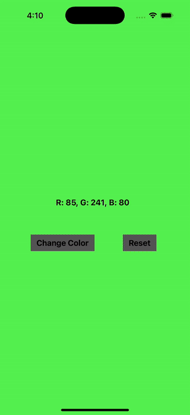

# 랜덤 컬러 생성 앱 프로젝트

### 학습 목표
1. UIKit 기본 컴포넌트 활용: UIButton, UILabel, UIView 등
2. 사용자 이벤트 처리: 버튼 클릭 시 발생하는 동작 구현
3. Auto Layout: 반응형 UI 구성
4. UIColor와 RGB 이해: 색상을 랜덤으로 생성하고, 그 값을 화면에 표시

### 구현할 기능
1. 랜덤 색상 생성: 버튼 클릭 시 배경색이 랜덤하게 변경
2. 색상 정보 표시: 현재 화면 배경색의 RGB 값을 화면에 표시
3. 초기화 기능: 초기화 버튼을 누르면 배경색이 흰색으로 변경되고, RGB 값도 초기화

### 요구 사항
1. UIView: 화면 전체를 덮는 배경 영역
2. UILabel: 중앙에 RGB 값 표시
3. UIButton: 화면 하단에 두 개의 버튼 배치
    - "Change Color" 버튼: 랜덤 색상 변경
    - "Reset" 버튼: 초기화

### 이슈 및 해결 방안
1. 레이블과 버튼의 색상이 고정되어 있어, 랜덤 색상에 따라 글자가 시인되지 않는 상황 발생
    - ~~배경색의 보색을 활용(255에서 배경의 RGB 값을 빼는 방법): 가독성이 보장되지 않음~~
    - 명도 차이를 활용하여 배경색상에 따라 글자색을 흰색 혹은 검정색으로 설정
    - 변경된 글자 색상에 따라 버튼의 배경색을 글자색보다 조금 더 어둡게 혹은 조금 더 밝게 설정

### 결과물

